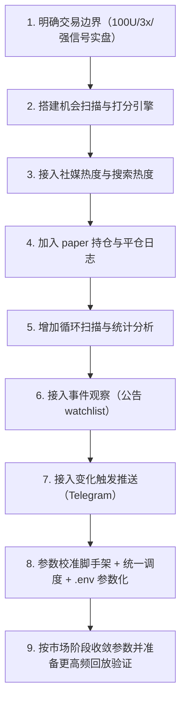

# 项目流程图

## 当前进度
- 当前进行到：`步骤 8 / 参数校准脚手架 + 统一调度脚本 + .env 参数化`
- 状态：`已完成`
- 下一步：`跑小样本循环，观察 calibration_report 与 paper 统计稳定性`

## 流程图

## 步骤说明
- 步骤 1：确认 Binance 合约、100U 验证账户、最大 3x 杠杆
- 步骤 2：完成市场阶段识别、机会打分、执行建议
- 步骤 3：接入 Binance Square 与 CoinGecko 热度
- 步骤 4：建立 paper 交易样本链路
- 步骤 5：完成循环扫描和统计脚本
- 步骤 6：加入公告事件观察模块
- 步骤 7：加入变化触发通知模块
- 步骤 8：完成参数校准脚手架、统一调度、参数外置
