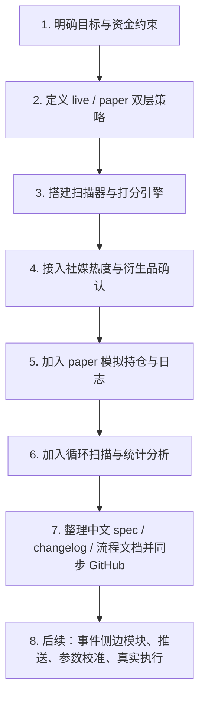

# 项目流程图

## 当前步骤

- 当前进行到：`步骤 7 / 已同步 GitHub 仓库并完成中文文档整理`
- 规则：每次阶段推进后，都更新这里的“当前步骤”

## 流程图

## 步骤说明

- 步骤 1：确认是 Binance 合约，不是现货；确认 100U 验证账户
- 步骤 2：明确强信号才给真实建议，普通信号只做观察，paper 对有效 setup 全量开仓
- 步骤 3：搭建基础扫描器、市场阶段判断、信号评分
- 步骤 4：接入 Binance Square 和 CoinGecko 热度，以及 Funding / OI 确认
- 步骤 5：加入模拟持仓、止损止盈、平仓日志
- 步骤 6：加入循环扫描和统计脚本
- 步骤 7：整理文档并同步到 GitHub
- 步骤 8：进入下一阶段扩展
